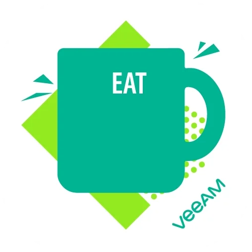

###  ✨ Hi there, you have made it! ✨

📫 How to reach me: Any of my Social-Media Platforms

------
 

<!--

-->

 

------

 

 

Hi, I'm Devran DOĞAN🙌. A software engineer, I like programming, mostly RL & DRL, but I am also interested in other Machine Learning models and Neural Networks. Apart from that I love learning, problem Solving, and studying Physics.❤

<!--  -->
<!--  -->

<!--  -->

**Talking about Personal Stuffs:**

- 🌱 I’m currently learning more about NN, RL and DRL.
- 💬 Ask me about anything, I would like to answer them.

<!--
- ⚡ Check out my recent [Blogs](https://medium.com/@)
- 📝[Portfolio](https://devran1.github.io/MyPortfolio/)
- ✨ I can draw too.[ArtGallery](https://www.instagram.com/@/) -->

<!--
**Community**
- Google Developer Group 
- HackClub 
- Tensorflow Community
- Coding Ninja
-->

**Languages and Tools:**
<!--  -->

<code></code>
<code></code>
<code></code>
<!-- <code></code> -->
<!-- <code></code> -->

